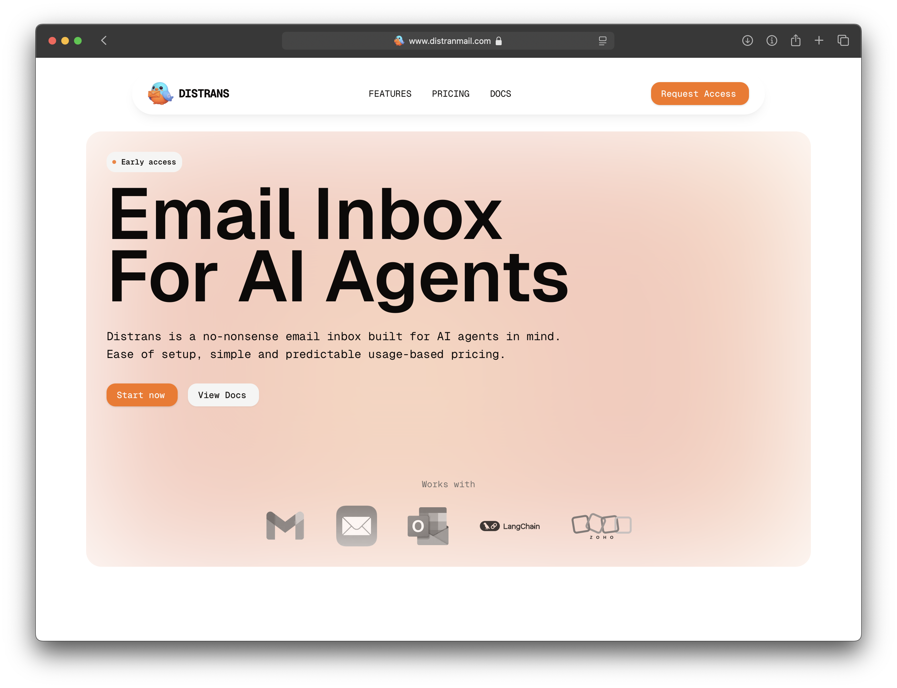

# Distrans - Email Inboxes for AI Agents

Distrans is a no-nonsense email infrastructure service built specifically for AI agents. Get unlimited inboxes with simple, predictable usage-based pricing.

## What is Distrans?

Distrans provides dedicated email inboxes for your AI agents, allowing them to send and receive emails just like human users. Built with developers in mind, it offers seamless integration with popular AI frameworks and email clients.

## Key Features

- 🚀 **Quick Setup** - Get started in 10 minutes with instant toolkit integration
- 📬 **Dedicated Inboxes** - Independent inbox per agent with unlimited addresses
- 🛠️ **Developer API** - RESTful endpoints and real-time webhooks
- ⚡ **Langchain Ready** - Built-in toolkit with Langraph support
- 📧 **Native Email** - Full thread & attachment support via AWS SES
- 🌐 **Custom Domains** - Bring your own domains to build brand trust

## Pricing

Simple, usage-based pricing starting at $2.00 per 1000 emails with volume discounts:

- First 50k emails: $2.00 per 1k
- Next 50k emails: $1.85 per 1k
- Next 150k emails: $1.70 per 1k
- Next 450k emails: $1.55 per 1k
- Beyond 700k emails: $1.40 per 1k

Included:

- Unlimited inboxes
- 30 days free data retention
- 1 custom domain
- Shared IP

## Early Access

Distrans is currently in early access. [Join the waitlist](https://distranmail.com#waitlist) to be among the first to try it out.

## Documentation

For technical details and integration guides, check out our [documentation](https://distranmail.com/docs).

## Learn More

Visit [distranmail.com](https://distranmail.com) to learn more about Distrans.
